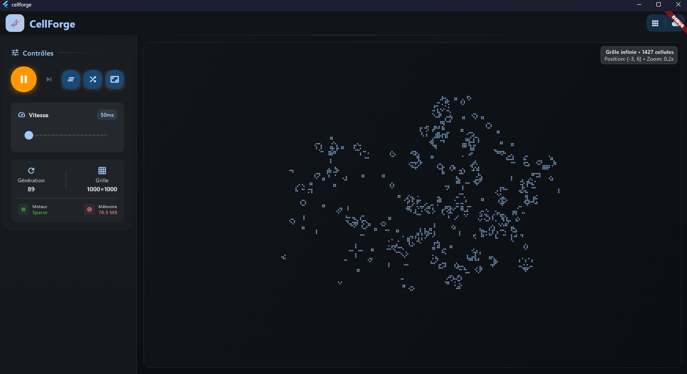
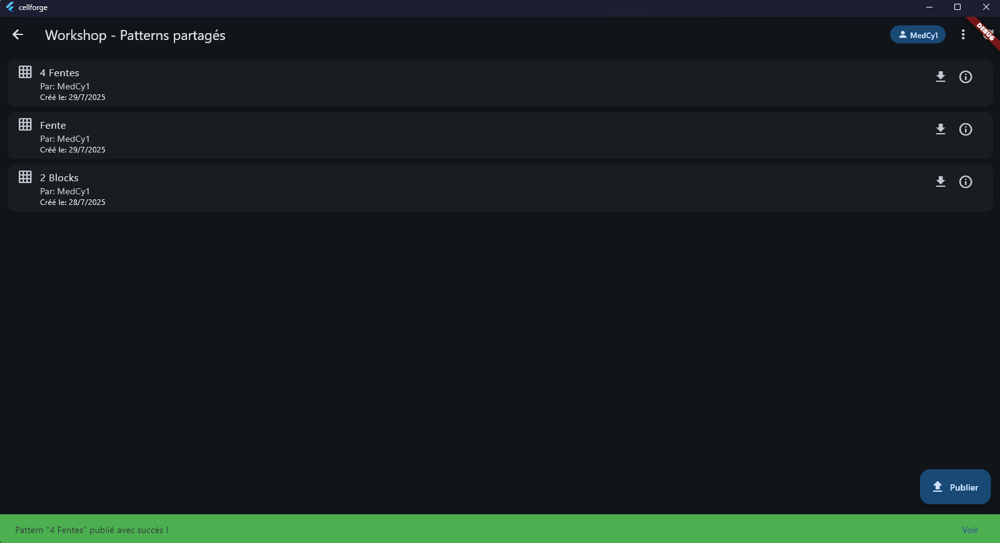

# 🧬 CellForge

**CellForge** est une application multiplateforme open-source qui réinvente le
**Jeu de la Vie de Conway** avec une interface moderne, des animations fluides,
un mode hors ligne et un **Workshop en ligne de patterns partagés**, propulsé
par **Supabase**.

> 💡 Créez. Simulez. Partagez la vie.

---

## ✨ Fonctionnalités principales

- 🔁 **Simulation locale** du Jeu de la Vie (cellules activables, grille
  dynamique, vitesse ajustable)
- 💾 **Mode hors ligne** complet
- ☁️ **Connexion à un Workshop Supabase** pour explorer, publier et importer des
  patterns
- 🎨 Interface fluide et réactive (Flutter 3+)
- 🧱 Architecture modulaire pour futures extensions
- 🛠️ Support du desktop (Windows/Linux/macOS) et du web (PWA-ready)
- 📱 Base prête pour un portage mobile (Android/iOS)

---

## 📸 Captures d'écran (à ajouter plus tard)

| Simulation en cours    | Import depuis le Workshop      |
| ---------------------- | ------------------------------ |
|  |  |

---

## 🚀 Installation rapide

### 📦 Prérequis

- Flutter 3.32+
- Supabase project avec table `patterns` (voir ci-dessous)
- (optionnel) VSCode ou Android Studio pour le développement

### ▶️ Lancer l’app

```bash
flutter pub get
flutter run -d chrome       # pour web
flutter run -d linux        # pour desktop Linux
flutter run -d android      # pour mobile (optionnel)
```

#### 🛠️ Configuration Supabase

##### 🎯 Table patterns

```sql
create table patterns (
    id uuid primary key default uuid_generate_v4(),
    name text not null,
    author text,
    data jsonb not null,
    created_at timestamp default now()
);

alter table patterns enable row level security;

create policy "public read" on patterns
    for select to anon
    using (true);
```

##### 🔑 Intégration dans Flutter

Ajoutez vos clés dans `lib/main.dart` :

```dart
await Supabase.initialize(
    url: 'https://<your-project>.supabase.co',
    anonKey: '<your-anon-key>',
);
```

---

## 🧩 Structure du projet

```
lib/
├── main.dart                # Entry point + Supabase init
├── ui/                      # Widgets de l’interface
│   ├── grid.dart
│   ├── toolbar.dart
│   └── workshop_browser.dart
├── core/                    # Logique du jeu de la vie
│   └── life_engine.dart
└── services/                # Intégration Supabase
        └── pattern_service.dart
```

---

## 📚 Roadmap

- Interface interactive pour le jeu de la vie
- Connexion Supabase (affichage patterns publics)
- Upload de patterns vers le workshop
- Auth (optionnel) pour uploader
- Filtres et tags
- Design responsive mobile
- Export/Import de .rle (format standard Game of Life)
- Animation grille optimisée (Skia / CustomPainter)

---

## 🤝 Contribuer

Ce projet est open-source, toute contribution est la bienvenue !

1. Fork le repo
2. Crée une branche : `git checkout -b ma-feature`
3. Commit tes changements : `git commit -am 'Ajoute une fonctionnalité'`
4. Push ta branche : `git push origin ma-feature`
5. Crée une Pull Request

---

## 🪪 Licence

MIT

---

👨‍💻 Créé avec passion par Médérick Rogé\
Contact : mederick.roge@gmail.com\
Projet né de l’envie de créer une expérience moderne, libre et communautaire
autour d’un classique intemporel.
